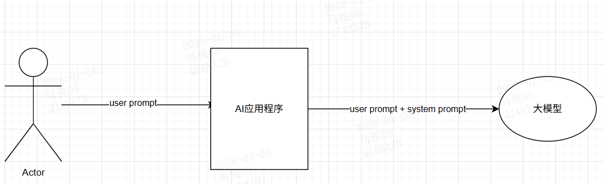
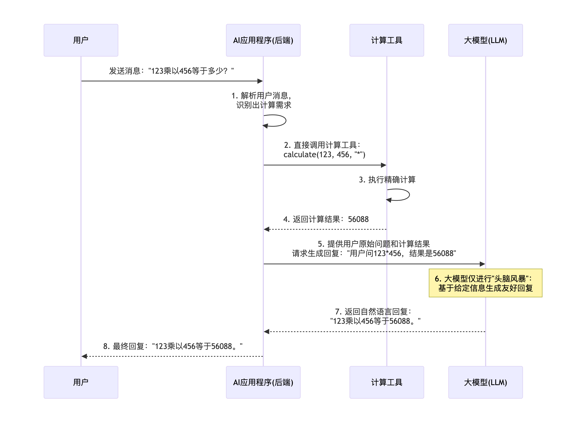
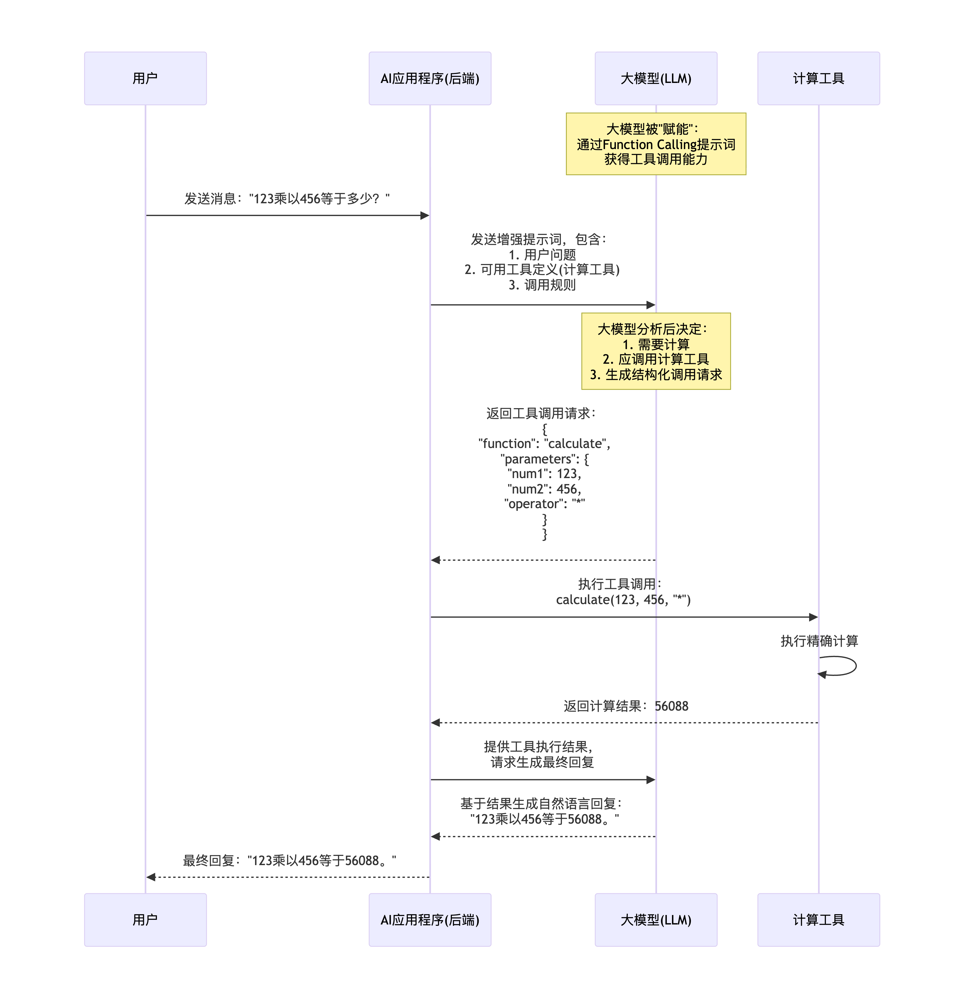
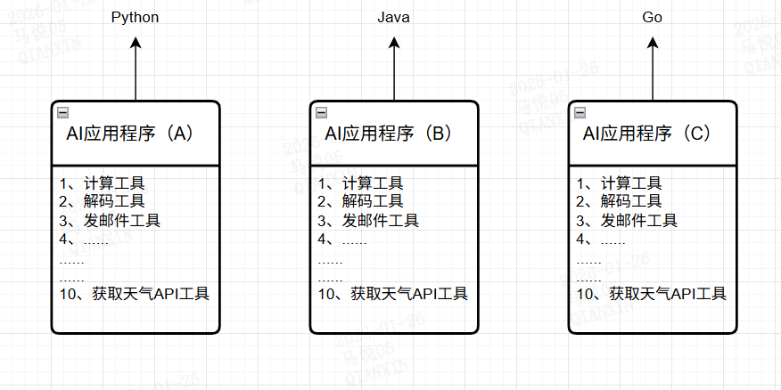
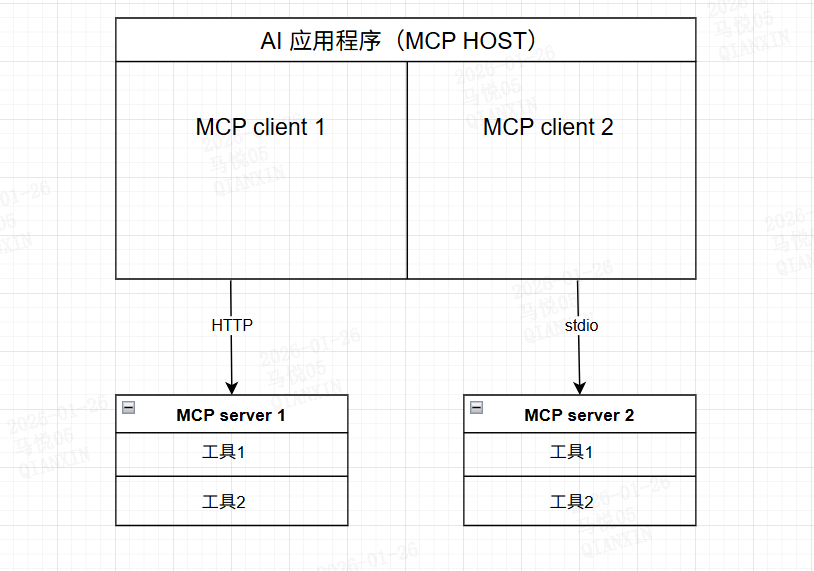
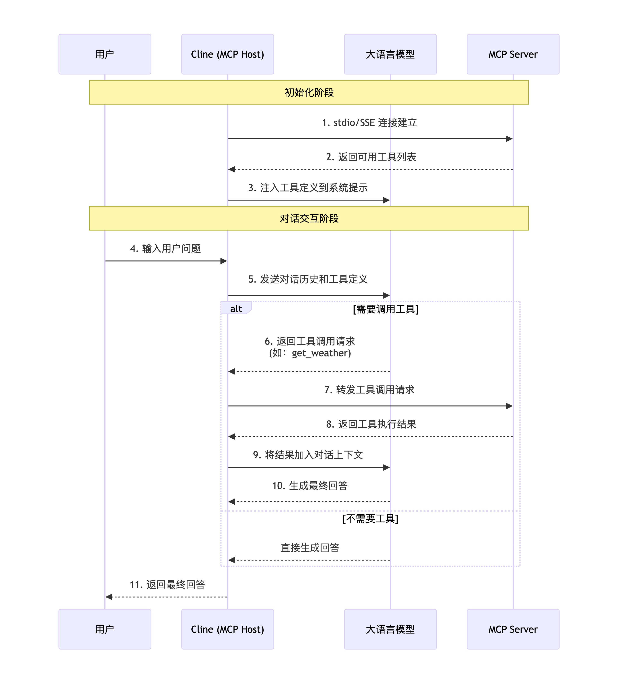
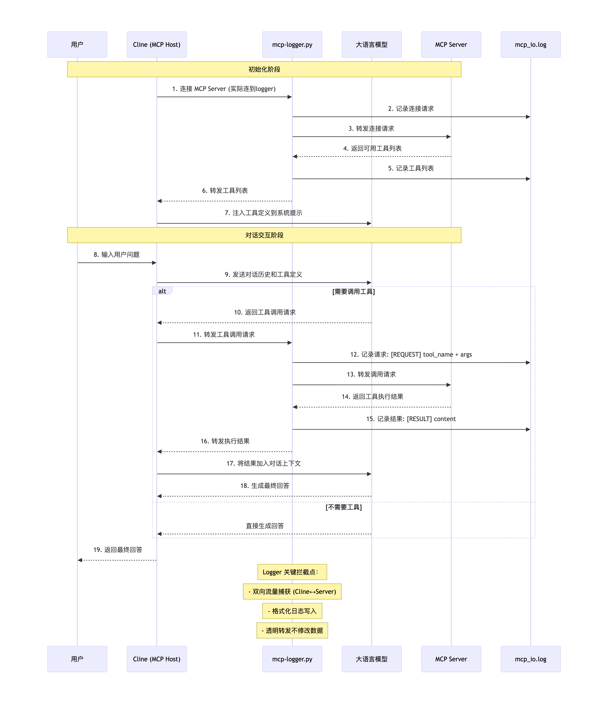
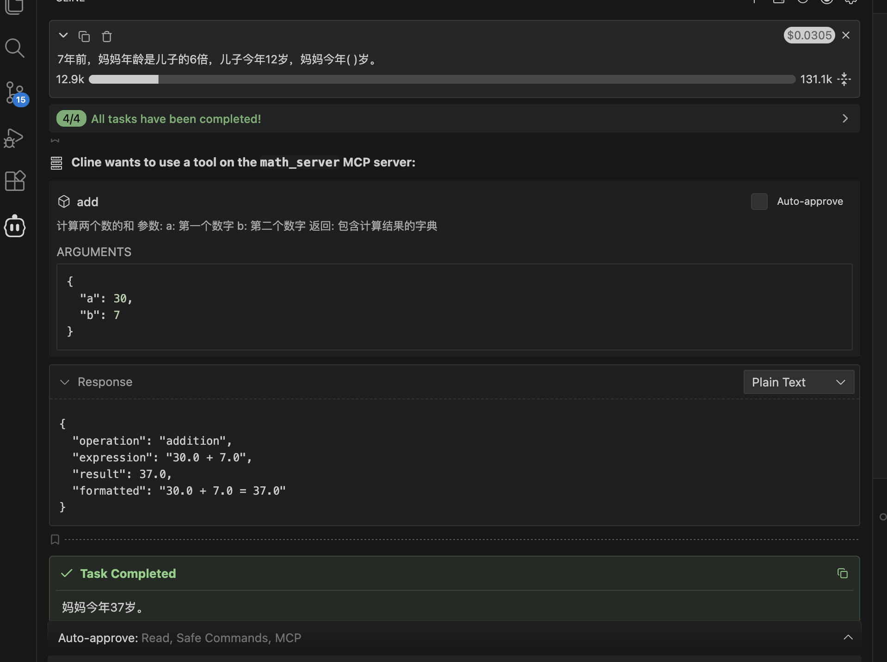

# 初始问答结构  

1、最基础结构一问一答，针对通用大模型  

USER(user prompt)：请你介绍一下命令执行漏洞  
LLM：好的，我们来全面、系统地介绍一下命令执行漏洞。
命令执行漏洞是Web安全领域中危害性极高的一种漏洞，它允许攻击者在目标服务器上直接执行操作系统命令，从而完全控制服务器。  
......  
......  

2、赋予大模型角色专门用于解决一些特定领域问题（一款专门研判告警的大模型）    



```
System Prompt: 
定义"网络安全专家"角色，以及一系列研判相关技巧
  ↓
User Prompt 1: "告警信息"
  ↓
模型响应: 以网络安全专家"角色分析告警，返回分析后的研判信息
```

## 思考？  
* 告警信息需要解码和计算的怎么处理？  
手动解码计算后发送再发送给模型进行分析  


# 工具调用  

背景：模型只具有聊天相关的功能，特别的，计算、解码、需要根据一些特定api接口获取对应数据以及帮助用户跑代码、发邮件等，这些是大模型的弱项，也就是没有调用工具的能力。  
主要概括为以下两点：  
1、缺失获取信息的能力。  
2、缺失必要动作的能力。  

## 解决办法  

### 后端+LLM  



一些问题：  
1、是否调用工具、调用什么工具由后端负责判断，逻辑复杂且容易误判。  
2、工具的参数部分值提取对于代码来说不是很智能。  

解决办法：  
**与其让AI什么都做，不如让它学会“使用工具”** 

大模型根据具体场景，决定需要调用什么工具，以及生成对应的参数给后端。  

### Function Calling+LLM

#### 概念  

参考文章：https://ai-doc.it-docs.cn/docs_en/guides_function-calling  

Function Calling是指大语言模型（LLM）能够识别用户意图，并结构化地输出调用外部工具/函数所需的参数的能力。这不是让AI直接执行代码，而是让AI“知道”何时、如何调用外部功能。

**特别的** 

Function Calling 是什么?  

- 广义的 Function Calling 是指让大模型能够调用外部工具的一种技术实现：先向大模型提供可用函数的列表及说明，由大模型在对话过程中智能判断是否需要调用函数，并自动生成调用所需的参数，最终用文字返回符合约定格式的函数调用请求。  
- 狭义的 Function Calling 特指大模型提供商在模型内部与 API 层面做了支持的一种能力，它最早由 OpenAI 引入  


具体流程：  
向大模型提供可用函数的列表及说明，由大模型在对话过程中智能判断是否需要调用函数，并自动生成调用所需的参数，最终用文字返回符合约定格式的函数调用请求。

1、模型能力：模型提供商需对大模型进行特别优化，使其具备根据上下文正确选择合适函数、生成有效参数的能力。
- 监督微调：使用（用户查询, 函数调用）配对数据
- 格式约束：强制模型输出特定JSON结构
- 强化学习：优化函数选择的准确性

2、API支持：模型提供商需额外开放对 Function Calling 的支持（比如 GPT API  中提供了一个 functions 参数）。

#### 基于提示词的Function Calling     



* 提示词例子  
```text
# 系统角色定义
你是数学计算助手，可以调用计算工具帮助用户解决数学问题。

# 可用工具定义
## 工具1：calculate - 四则运算计算器
描述：执行精确的加减乘除运算
参数规范：
- num1: number (必需) - 第一个操作数
- num2: number (必需) - 第二个操作数  
- operator: string (必需) - 运算符，枚举值: ["+", "-", "*", "/", "加", "减", "乘", "除"]

# 工具调用规范
1. 当用户的问题涉及数字计算时，必须调用calculate工具
2. 识别用户问题中的数字和运算符，转换为标准格式
3. 对于中文运算符，需要转换为符号：
   "加" → "+", "减" → "-", "乘" → "*", "除" → "/"
4. 输出必须为有效的JSON格式

# 示例对话
用户: "5加3等于多少？"
助手: {"function": "calculate", "parameters": {"num1": 5, "num2": 3, "operator": "+"}}

用户: "计算10除以2"
助手: {"function": "calculate", "parameters": {"num1": 10, "num2": 2, "operator": "/"}}

用户: "123乘456"
助手: {"function": "calculate", "parameters": {"num1": 123, "num2": 456, "operator": "*"}}

# 当前用户问题
用户: {user_question}

请严格按照上述规范响应：
```

* 一些问题   
1、**输出格式不稳定**   
调用指令中存在多余自然语言、不同模型返回信息不稳定，不遵循指令严格返回。  
2、**模型幻觉**  
模型可能编造并不存在的函数名或参数。  
3、**开发有一定成本**    
函数描述、调用指令格式、提示词逻辑完全由开发者设计。  
4、**数据量冗杂，消耗token**  
为确保调用逻辑正确，往往需要在 system prompt 中加入大量说明与规则。   


#### 基于api的function calling  
- OpenAI格式    
```python
# OpenAI / Azure OpenAI 格式
import openai

response = client.chat.completions.create(
    model="gpt-4",
    messages=[{"role": "user", "content": "What's the weather in San Francisco?"}],
    tools=[{  # OpenAI已从functions改为tools
        "type": "function",
        "function": {
            "name": "get_current_weather",
            "description": "Get the current weather in a given location",
            "parameters": {
                "type": "object",
                "properties": {
                    "location": {
                        "type": "string",
                        "description": "The city and state, e.g. San Francisco, CA"
                    },
                    "unit": {
                        "type": "string",
                        "enum": ["celsius", "fahrenheit"],
                        "default": "fahrenheit"
                    }
                },
                "required": ["location"]
            }
        }
    }],
    tool_choice="auto"  # 也可以是"none"或具体函数名
)

# 响应结构
tool_calls = response.choices[0].message.tool_calls
# 返回的是ToolCall对象数组，每个包含：
# tool_calls[0].id
# tool_calls[0].type = "function"
# tool_calls[0].function.name
# tool_calls[0].function.arguments (JSON字符串)
```
- Anthropic Claude格式  
```python 
# Anthropic Claude格式（显著不同）
import anthropic

response = client.messages.create(
    model="claude-3-opus-20240229",
    max_tokens=1000,
    messages=[{"role": "user", "content": "What's the weather in San Francisco?"}],
    tools=[{  # Anthropic使用完全不同的结构
        "name": "get_current_weather",
        "description": "Get the current weather in a given location",
        "input_schema": {  # 这里的关键词不同
            "type": "object",
            "properties": {
                "location": {
                    "type": "string", 
                    "description": "The city and state"
                },
                "unit": {
                    "type": "string",
                    "enum": ["celsius", "fahrenheit"],
                    "default": "fahrenheit"
                }
            },
            "required": ["location"]
        }
    }]
)

# 响应结构完全不同
if response.stop_reason == "tool_use":
    tool_use = response.content[0]  # 直接是内容的一部分
    # tool_use.name
    # tool_use.input (已经是字典，不是JSON字符串)
    # 也没有单独的tool_call_id概念
```
- Google Gemini格式  
```python
# Google Gemini格式（又是另一种）
import google.generativeai as genai

# Gemini需要先定义工具
weather_tool = genai.protocol.FunctionDeclaration(
    name="get_current_weather",
    description="Get the current weather in a given location",
    parameters={
        "type": "object",
        "properties": {
            "location": {
                "type": "string",
                "description": "The city and state"
            },
            "unit": {
                "type": "string",
                "enum": ["celsius", "fahrenheit"],
                "default": "fahrenheit"
            }
        },
        "required": ["location"]
    }
)

# 再封装成工具
tools = [genai.protocol.Tool(
    function_declarations=[weather_tool]
)]

# API调用方式也不同
model = genai.GenerativeModel(
    model_name="gemini-pro",
    tools=tools,
    tool_config={"function_calling_config": "auto"}  # 配置方式不同
)

response = model.generate_content("What's the weather in San Francisco?")

# 响应解析也完全不同
if response.candidates[0].content.parts[0].function_call:
    fc = response.candidates[0].content.parts[0].function_call
    # fc.name
    # fc.args (已经是字典)
```

##### 具体使用例子    

参考文档：https://ai-doc.it-docs.cn/docs_en/guides_function-calling  

1、用户提问  
请你帮忙计算123*456等于多少？  
2、后端第一次向大模型 API 发起请求，获取函数调用指令  
后端向大模型 API 传入用户原始输入、函数描述和其他上下文信息，获取调用指令。函数描述包括函数名称、用途说明、参数结构等。例如：  

**后端代码**  
```python
import openai
import json

# 初始化客户端（实际使用中应配置API Key）
client = openai.OpenAI(api_key="your-api-key")

# 定义计算工具的函数描述
tools = [
    {
        "type": "function",
        "function": {
            "name": "calculate",
            "description": "执行数学四则运算",
            "parameters": {
                "type": "object",
                "properties": {
                    "num1": {
                        "type": "number",
                        "description": "第一个数字"
                    },
                    "num2": {
                        "type": "number",
                        "description": "第二个数字"
                    },
                    "operator": {
                        "type": "string",
                        "enum": ["+", "-", "*", "/"],
                        "description": "运算符：加(+)、减(-)、乘(*)、除(/)"
                    }
                },
                "required": ["num1", "num2", "operator"],
                "additionalProperties": false
            }
        }
    }
]

# 第一次API调用：获取函数调用指令
first_response = client.chat.completions.create(
    model="gpt-3.5-turbo-1106",  # 或 "gpt-4"
    messages=[
        {
            "role": "system",
            "content": "你是一个数学计算助手。当用户询问数学计算问题时，请调用calculate函数。"
        },
        {
            "role": "user", 
            "content": "请你帮忙计算123*456等于多少？"
        }
    ],
    tools=tools,
    tool_choice="auto"  # 让模型自动决定是否调用工具
)
```

**请求的json格式数据**
```json
{
  "model": "gpt-3.5-turbo-1106",
  "messages": [
    {"role": "system", "content": "你是一个数学计算助手。当用户询问数学计算问题时，请调用calculate函数。"},
    {"role": "user", "content": "请你帮忙计算123*456等于多少？"}
  ],
  "tools": [
    {
      "type": "function",
      "function": {
        "name": "calculate",
        "description": "执行数学四则运算",
        "parameters": {
          "type": "object",
          "properties": {
            "num1": {"type": "number", "description": "第一个数字"},
            "num2": {"type": "number", "description": "第二个数字"},
            "operator": {
              "type": "string",
              "enum": ["+", "-", "*", "/"],
              "description": "运算符：加(+)、减(-)、乘(*)、除(/)"
            }
          },
          "required": ["num1", "num2", "operator"],
          "additionalProperties": false
        }
      }
    }
  ],
  "tool_choice": "auto"
}
```
3、模型生成调用指令    
模型会智能判断是否需要调用函数，选择合适的函数，并基于上下文自动生成结构化的调用指令（函数名 + 参数），例如：

**模型返回的响应**  
```json
{
  "id": "chatcmpl-123456789",
  "object": "chat.completion",
  "created": 1677652288,
  "model": "gpt-3.5-turbo-1106",
  "choices": [
    {
      "index": 0,
      "message": {
        "role": "assistant",
        "content": null,
        "tool_calls": [
          {
            "id": "call_abc123",
            "type": "function",
            "function": {
              "name": "calculate",
              "arguments": "{\"num1\": 123, \"num2\": 456, \"operator\": \"*\"}"
            }
          }
        ]
      },
      "finish_reason": "tool_calls"
    }
  ],
  "usage": {
    "prompt_tokens": 85,
    "completion_tokens": 23,
    "total_tokens": 108
  }
}
```

**后端提取调用指令**
```python
# 解析模型返回的调用指令
message = first_response.choices[0].message

if message.tool_calls:
    tool_call = message.tool_calls[0]
    function_name = tool_call.function.name  # "calculate"
    arguments_str = tool_call.function.arguments  # '{"num1": 123, "num2": 456, "operator": "*"}'
    call_id = tool_call.id  # "call_abc123"
    
    print(f"需要调用的函数: {function_name}")
    print(f"参数: {arguments_str}")
    print(f"调用ID: {call_id}")
```
4、后端解析调用指令，并执行实际的函数调用  
后端接收到模型返回的调用指令后，解析调用指令，得到函数名称和参数，执行对应的方法（如调用乘法计算函数），并获取结果。调用指令例如：

**后端解析参数并执行计算**  
```python
import json
import math

def calculate(num1: float, num2: float, operator: str) -> dict:
    """
    执行数学计算的实际函数
    """
    try:
        if operator == "+":
            result = num1 + num2
        elif operator == "-":
            result = num1 - num2
        elif operator == "*":
            result = num1 * num2
        elif operator == "/":
            if num2 == 0:
                return {
                    "success": False,
                    "error": "除数不能为零",
                    "result": None
                }
            result = num1 / num2
        else:
            return {
                "success": False,
                "error": f"不支持的运算符: {operator}",
                "result": None
            }
        
        return {
            "success": True,
            "result": result,
            "expression": f"{num1} {operator} {num2}",
            "formatted_result": format_result(result)
        }
        
    except Exception as e:
        return {
            "success": False,
            "error": str(e),
            "result": None
        }

def format_result(value: float) -> str:
    """格式化结果，处理浮点数精度"""
    if value.is_integer():
        return str(int(value))
    # 保留2位小数
    return f"{value:.2f}"

# 解析JSON参数
arguments = json.loads(arguments_str)
num1 = arguments["num1"]  # 123
num2 = arguments["num2"]  # 456
operator = arguments["operator"]  # "*"

# 执行实际的函数调用
calculation_result = calculate(num1, num2, operator)
print("计算结果:", calculation_result)

# 预期输出:
# {
#   "success": True,
#   "result": 56088,
#   "expression": "123 * 456",
#   "formatted_result": "56088"
# }
```
5、后端第二次向大模型 API 发起请求，将刚才的调用结果和其他上下文信息一起传给模型，生成最终的回复  

**后端将计算结果传给大模型，大模型生成回复返回**  
```python
# 构建工具调用的结果消息
tool_message = {
    "role": "tool",
    "tool_call_id": call_id,  # 必须与第一次调用返回的ID对应
    "content": json.dumps(calculation_result, ensure_ascii=False)
}

# 第二次API调用：生成最终回复
second_response = client.chat.completions.create(
    model="gpt-3.5-turbo-1106",
    messages=[
        {
            "role": "system",
            "content": "你是一个数学计算助手。当用户询问数学计算问题时，请调用calculate函数。"
        },
        {
            "role": "user", 
            "content": "请你帮忙计算123*456等于多少？"
        },
        {
            "role": "assistant",
            "content": None,
            "tool_calls": [
                {
                    "id": call_id,
                    "type": "function",
                    "function": {
                        "name": "calculate",
                        "arguments": arguments_str
                    }
                }
            ]
        },
        tool_message  # 包含计算结果的工具消息
    ]
)

# 获取最终回复
final_answer = second_response.choices[0].message.content
print("最终回复:", final_answer)

# 预期输出类似:
# "123乘以456等于56088。"
# 或
# "根据计算结果，123 × 456 = 56088。"
```

**第二次完整发送给模型的json格式数据**  
```json
[
  {"role": "system", "content": "你是一个数学计算助手。当用户询问数学计算问题时，请调用calculate函数。"},
  {"role": "user", "content": "请你帮忙计算123*456等于多少？"},
  {
    "role": "assistant",
    "content": null,
    "tool_calls": [
      {
        "id": "call_abc123",
        "type": "function", 
        "function": {
          "name": "calculate",
          "arguments": "{\"num1\": 123, \"num2\": 456, \"operator\": \"*\"}"
        }
      }
    ]
  },
  {
    "role": "tool",
    "tool_call_id": "call_abc123",
    "content": "{\"success\": true, \"result\": 56088, \"expression\": \"123 * 456\", \"formatted_result\": \"56088\"}"
  }
]
```

* 一些问题  
1、模型绑定严重，缺乏标准化  
```python
# 不同厂商的API差异巨大

# OpenAI格式
tools = [{
    "type": "function",
    "function": {
        "name": "calculate",
        "description": "...",
        "parameters": {...}
    }
}]

# Anthropic Claude格式
tools = [{
    "name": "calculate",
    "description": "...",
    "input_schema": {...}  # 注意：这里是input_schema不是parameters
}]

# Google Gemini格式
tools = [{
    "function_declarations": [{  # 注意：字段名不同
        "name": "calculate",
        "description": "...",
        "parameters": {...}
    }]
}]

# Azure OpenAI格式
tools = [{
    "type": "function",
    "function": {
        "function": {  # 嵌套结构不同
            "name": "calculate",
            "description": "...",
            "parameters": {...}
        },
        "name": "calculate"
    }
}]
```

2、代码冗余和维护负担  
```python
# 为不同模型编写适配代码
class ModelAdapter:
    def adapt_for_openai(self, tools):
        # OpenAI适配逻辑
        return {
            "tools": tools,
            "tool_choice": "auto"
        }
    
    def adapt_for_claude(self, tools):
        # Claude适配逻辑
        claude_tools = []
        for tool in tools:
            claude_tools.append({
                "name": tool["function"]["name"],
                "description": tool["function"]["description"],
                "input_schema": tool["function"]["parameters"]  # 字段名不同
            })
        return {
            "tools": claude_tools
        }
    
    def adapt_for_gemini(self, tools):
        # Gemini适配逻辑
        function_declarations = []
        for tool in tools:
            function_declarations.append({
                "name": tool["function"]["name"],
                "description": tool["function"]["description"],
                "parameters": tool["function"]["parameters"]
            })
        return {
            "tools": {"function_declarations": function_declarations}
        }
    
    def parse_openai_response(self, response):
        # 解析OpenAI响应
        if response.choices[0].message.tool_calls:
            return response.choices[0].message.tool_calls[0]
    
    def parse_claude_response(self, response):
        # 解析Claude响应
        if hasattr(response, 'content') and response.content[0].type == 'tool_use':
            return response.content[0]
```

3、可选模型有限  
主流大厂支持Function Calling  
开源模型（Llama、Qwen、DeepSeek等）支持不一致  
新模型推出时适配延迟  

4、上下文长度浪费  
```python
# 每次请求都需要重复发送完整的工具定义
messages = [
    {"role": "user", "content": "计算123*456"},
    {"role": "assistant", "content": None, "tool_calls": [...]},
    {"role": "tool", "content": "...", "tool_call_id": "..."}
]
# 工具定义作为参数重复发送
# 随着工具增多，token消耗显著增加
```

5、相同工具接入重复开发，复用困难  

* 举个栗子  




```python
# 当前状态：每个AI应用都需要重复实现相同的工具

# 应用A：计算工具实现
class CalculatorA:
    def add(self, a, b): return a + b
    # 需要完整实现所有数学运算

# 应用B：同样的计算工具
class CalculatorB:
    def add(self, a, b): return a + b  # 完全相同的代码！
    # 重复实现，没有复用

# 应用C：还是同样的计算工具  
class CalculatorC:
    def add(self, a, b): return a + b  # 又来一遍！
```

假设有100个AI应用，每个应用需要10个工具：  
总代码复制量：100 × 10 = 1000次复制   
维护成本：当工具更新时，需要通知100个应用更新  

6、没有开发基础的用户如何实现工具调用？  

# MCP协议

针对于上述问题5和6，也就是工具内部问题，产生了MCP方案  

参考文档：https://modelcontextprotocol.io/docs/getting-started/intro   

## 解决方案  

1、解耦：工具独立部署   
2、标准化：统一交互协议  
3、实现工具共享  

## MCP协议是什么  

2024 年 11 月由 Anthropic（一家美国人工智能初创公司）提出，文档：https://modelcontextprotocol.io/docs/getting-started/intro  

* 定义  

> MCP (Model Context Protocol) is an open-source standard for connecting AI applications to external systems.Using MCP, AI applications like Claude or ChatGPT can connect to data sources (e.g. local files, databases), tools (e.g. search engines, calculators) and workflows (e.g. specialized prompts)—enabling them to access key information and perform tasks.Think of MCP like a USB-C port for AI applications. Just as USB-C provides a standardized way to connect electronic devices, MCP provides a standardized way to connect AI applications to external systems.  

MCP（模型上下文协议）是一种用于将人工智能应用程序连接到外部系统的开源标准。通过 MCP，像 Claude 或 ChatGPT 这样的 AI 应用程序可以连接到数据源（例如本地文件、数据库）、工具（例如搜索引擎、计算器）和工作流程（例如专业提示）——使它们能够获取关键信息并执行任务。可以把 MCP 想象成 AI 应用程序的 USB-C 接口。正如 USB-C 提供了一种标准化的方式来连接电子设备，MCP 也提供了一种标准化的方式来将 AI 应用程序连接到外部系统。  

### MCP的组成  

#### 客户端-服务器架构    

>MCP follows a client-server architecture where an MCP host — an AI application like [Claude Code](https://www.anthropic.com/claude-code) or [Claude Desktop](https://www.claude.ai/download) — establishes connections to one or more MCP servers. The MCP host accomplishes this by creating one MCP client for each MCP server. Each MCP client maintains a dedicated connection with its corresponding MCP server.Local MCP servers that use the STDIO transport typically serve a single MCP client, whereas remote MCP servers that use the Streamable HTTP transport will typically serve many MCP clients.The key participants in the MCP architecture are:  

- **MCP Host**: The AI application that coordinates and manages one or multiple MCP clients
- **MCP Client**: A component that maintains a connection to an MCP server and obtains context from an MCP server for the MCP host to use
- **MCP Server**: A program that provides context to MCP clients

MCP采用客户端-服务器架构，其中MCP主机——例如Claude Code或Claude Desktop这样的AI应用——与一个或多个MCP服务器建立连接。MCP主机通过为每个MCP服务器创建一个MCP客户端来实现这一点。每个MCP客户端与其对应的MCP服务器保持专用连接。
使用STDIO传输的本地MCP服务器通常只为单个MCP客户端提供服务，而使用可流式HTTP传输的远程MCP服务器通常会为多个MCP客户端提供服务。  

MCP架构中的关键参与者是：

* MCP主机：协调和管理一个或多个MCP客户端的AI应用
* MCP客户端：维护与MCP服务器的连接，并从MCP服务器获取上下文供MCP主机使用的组件
* MCP服务器：为MCP客户端提供上下文的程序



> **For example**: Visual Studio Code acts as an MCP host. When Visual Studio Code establishes a connection to an MCP server, such as the [Sentry MCP server](https://docs.sentry.io/product/sentry-mcp/), the Visual Studio Code runtime instantiates an MCP client object that maintains the connection to the Sentry MCP server. When Visual Studio Code subsequently connects to another MCP server, such as the [local filesystem server](https://github.com/modelcontextprotocol/servers/tree/main/src/filesystem), the Visual Studio Code runtime instantiates an additional MCP client object to maintain this connection.

例如：Visual Studio Code 充当 MCP 主机。当 Visual Studio Code 与 MCP 服务器（例如 Sentry MCP 服务器）建立连接时，Visual Studio Code 运行时会实例化一个 MCP 客户端对象来维护与 Sentry MCP 服务器的连接。当 Visual Studio Code 随后连接到另一个 MCP 服务器，例如本地文件系统服务器时，Visual Studio Code 运行时会实例化一个额外的 MCP 客户端对象来维护该连接。    

#### MCP layer 组成    

MCP consists of two layers:

- **Data layer**: Defines the JSON-RPC based protocol for client-server communication, including lifecycle management, and core primitives, such as tools, resources, prompts and notifications.
- **Transport layer**: Defines the communication mechanisms and channels that enable data exchange between clients and servers, including transport-specific connection establishment, message framing, and authorization.

MCP由两层组成：  

* **数据层**：定义基于JSON-RPC的客户端与服务器通信协议，包括生命周期管理以及核心原语，如工具、资源、提示和通知。
* **传输层**：定义实现客户端与服务器之间数据交换的通信机制和通道，包括特定传输的连接建立、消息分帧和授权。  

### MCP支持的传输机制  

> The transport layer manages communication channels and authentication between clients and servers. It handles connection establishment, message framing, and secure communication between MCP participants.MCP supports two transport mechanisms:

- **Stdio transport**: Uses standard input/output streams for direct process communication between local processes on the same machine, providing optimal performance with no network overhead.
- **Streamable HTTP transport**: Uses HTTP POST for client-to-server messages with optional Server-Sent Events for streaming capabilities. This transport enables remote server communication and supports standard HTTP authentication methods including bearer tokens, API keys, and custom headers. MCP recommends using OAuth to obtain authentication tokens.  

传输层管理客户端和服务器之间的通信通道和身份验证。它处理连接建立、消息分帧以及 MCP 参与者之间的安全通信。
MCP 支持两种传输机制：  

* **Stdio 传输**：使用标准输入/输出流在同一台机器上的本地进程之间进行直接进程通信，提供最佳性能，无网络开销。
* **可流式 HTTP 传输**：使用 HTTP POST 进行客户端到服务器的消息传递，并可选择性使用服务器发送事件（Server-Sent Events）实现流式功能。此传输方式支持远程服务器通信，并支持包括承载令牌、API 密钥和自定义头在内的标准 HTTP 身份验证方法。MCP 建议使用 OAuth 获取身份验证令牌。  

##### stdio传输  

**Stdio 传输**：使用标准输入/输出流在同一台机器上的本地进程之间进行直接进程通信，提供最佳性能，无网络开销。  

##### HTTP + SSE 传输   

**SSE**（Server-Sent Events服务器发送事件），是一种服务器单向推送数据给客户端的技术，基于 HTTP 协议。  

- 支持服务端主动、流式地推送消息  
- 服务端推送的必要性：MCP Server 中的工具发生了更新，需要主动向 MCP Client 推送通知

##### Streamable HTTP 传输  
HTTP + SSE 传输方案的升级版，目前正在逐步取代原有的 HTTP + SSE 传输方案  
链接：https://github.com/modelcontextprotocol/modelcontextprotocol/pull/206  

在一个 HTTP 连接里，服务端可以持续不断地发送数据给客户端，客户端边接收边处理，类似“流”一样。  

问题：为什么要升级为Streamable HTTP 传输 ？  

- 数据格式限制问题：SSE 的 Content-Type: text/event-stream 只支持文本格式；Streamable HTTP 的Content-Type支持任意格式，如 JSON、HTML、二进制等，更适合 AI 场景（可能要传 JSON + 音频 + 图片）
- 跨平台兼容问题：SSE 支持的客户端主要是浏览器端和少量语言库；而 Streamable HTTP 支持多种客户端。
- 性能问题：SSE 是基于 HTTP/1.1 长连接，Streamable HTTP 可以基于 HTTP/2/3 ，支持多路复用和双向流。且 HTTP/2/3 的流控制和优先级机制使得高吞吐和低延迟成为可能；SSE 消息只能文本格式，Streamable HTTP 支持其他采用更紧凑的编码方式（比如二进制分包、压缩等）。  


## 简易MCP客户端+服务端进行数学计算     

### 本地      
```
source .venv/bin/activate
uv run main.py ../server/math_server.py
```


## MCP 交互的过程（以cline的交互为例）    

### mcp server网站    

1、https://mcp.so/zh  

2、https://www.mcpworld.com/  

3、https://mcpmarket.cn/  

### mcp server场景的启动方式  

1、uvx  

参考：https://uv.doczh.com/guides/tools/  

**概念**：通过 `uv` 包管理器的 `uvx` 命令直接运行 MCP 服务器。

```json
{
  "mcpServers": {
    "VulnReproductionTool": {
      "command": "uvx",
      "args": ["read-file-content-tool"]  // 假设这是一个已发布的包
    }
  }
}
```

特别的运行本地项目，未打包发布的代码  

```json
{
  "mcpServers": {
    "VulnReproductionTool": {
      "command": "uv",  // 使用 uv 而不是 uvx
      "args": [
          "--directory",
          "/Users/yue/PycharmProjects/知识分享/new-agent/server",
          "run",
          "read_file_content.py"
      ]
    }
  }
}
```

2、npx   

不举例了，安装Node.js后和uvx启动方式差不多 

### Cline 与 大模型交互流程   



#### cline和mcp server的交互流程  

* 输入：cline--->mcp server  
* 输出：mcp server --->cline



1、mcp server注册日志  

```tex
输入: {"method":"initialize","params":{"protocolVersion":"2025-11-25","capabilities":{},"clientInfo":{"name":"Cline","version":"3.51.0"}},"jsonrpc":"2.0","id":0}
输出: {"jsonrpc":"2.0","id":0,"result":{"protocolVersion":"2025-11-25","capabilities":{"experimental":{},"prompts":{"listChanged":false},"resources":{"subscribe":false,"listChanged":false},"tools":{"listChanged":false}},"serverInfo":{"name":"math","version":"1.25.0"}}}
输入: {"method":"notifications/initialized","jsonrpc":"2.0"}
输入: {"method":"tools/list","jsonrpc":"2.0","id":1}
STDERR: [01/18/26 16:55:11] INFO     Processing request of type            server.py:713
STDERR:                              ListToolsRequest                                   
输出: {"jsonrpc":"2.0","id":1,"result":{"tools":[{"name":"add","description":"\n    计算两个数的和\n\n    参数:\n        a: 第一个数字\n        b: 第二个数字\n\n    返回:\n        包含计算结果的字典\n    ","inputSchema":{"properties":{"a":{"title":"A","type":"number"},"b":{"title":"B","type":"number"}},"required":["a","b"],"title":"addArguments","type":"object"},"outputSchema":{"properties":{"result":{"additionalProperties":true,"title":"Result","type":"object"}},"required":["result"],"title":"addOutput","type":"object"}},{"name":"subtract","description":"\n    计算两个数的差\n\n    参数:\n        a: 被减数\n        b: 减数\n\n    返回:\n        包含计算结果的字典\n    ","inputSchema":{"properties":{"a":{"title":"A","type":"number"},"b":{"title":"B","type":"number"}},"required":["a","b"],"title":"subtractArguments","type":"object"},"outputSchema":{"properties":{"result":{"additionalProperties":true,"title":"Result","type":"object"}},"required":["result"],"title":"subtractOutput","type":"object"}},{"name":"multiply","description":"\n    计算两个数的乘积\n\n    参数:\n        a: 第一个因数\n        b: 第二个因数\n\n    返回:\n        包含计算结果的字典\n    ","inputSchema":{"properties":{"a":{"title":"A","type":"number"},"b":{"title":"B","type":"number"}},"required":["a","b"],"title":"multiplyArguments","type":"object"},"outputSchema":{"properties":{"result":{"additionalProperties":true,"title":"Result","type":"object"}},"required":["result"],"title":"multiplyOutput","type":"object"}},{"name":"divide","description":"\n    计算两个数的商\n\n    参数:\n        a: 被除数\n        b: 除数 (不能为0)\n\n    返回:\n        包含计算结果的字典\n    ","inputSchema":{"properties":{"a":{"title":"A","type":"number"},"b":{"title":"B","type":"number"}},"required":["a","b"],"title":"divideArguments","type":"object"},"outputSchema":{"properties":{"result":{"additionalProperties":true,"title":"Result","type":"object"}},"required":["result"],"title":"divideOutput","type":"object"}},{"name":"power","description":"\n    计算幂运算\n\n    参数:\n        base: 底数\n        exponent: 指数\n\n    返回:\n        包含计算结果的字典\n    ","inputSchema":{"properties":{"base":{"title":"Base","type":"number"},"exponent":{"title":"Exponent","type":"number"}},"required":["base","exponent"],"title":"powerArguments","type":"object"},"outputSchema":{"properties":{"result":{"additionalProperties":true,"title":"Result","type":"object"}},"required":["result"],"title":"powerOutput","type":"object"}},{"name":"square_root","description":"\n    计算平方根\n\n    参数:\n        number: 非负数\n\n    返回:\n        包含计算结果的字典\n    ","inputSchema":{"properties":{"number":{"title":"Number","type":"number"}},"required":["number"],"title":"square_rootArguments","type":"object"},"outputSchema":{"properties":{"result":{"additionalProperties":true,"title":"Result","type":"object"}},"required":["result"],"title":"square_rootOutput","type":"object"}},{"name":"batch_calculate","description":"\n    批量执行多个计算\n\n    参数:\n        operations: 计算表达式，用分号分隔\n                  示例: \"2+3; 5*4; 10/2\"\n\n    返回:\n        包含所有计算结果的字典\n    ","inputSchema":{"properties":{"operations":{"title":"Operations","type":"string"}},"required":["operations"],"title":"batch_calculateArguments","type":"object"},"outputSchema":{"properties":{"result":{"additionalProperties":true,"title":"Result","type":"object"}},"required":["result"],"title":"batch_calculateOutput","type":"object"}}]}}
输入: {"method":"resources/list","jsonrpc":"2.0","id":2}
STDERR:                     INFO     Processing request of type            server.py:713
STDERR:                              ListResourcesRequest                               
输出: {"jsonrpc":"2.0","id":2,"result":{"resources":[]}}
输入: {"method":"resources/templates/list","jsonrpc":"2.0","id":3}
STDERR:                     INFO     Processing request of type            server.py:713
STDERR:                              ListResourceTemplatesRequest                       
输出: {"jsonrpc":"2.0","id":3,"result":{"resourceTemplates":[]}}

```

（1）初始化阶段  
客户端：Cline (v3.51.0) 向服务器发送初始化请求  

服务器：math 服务器 (v1.25.0) 响应，确认支持的协议版本和功能  

（2）服务端就绪通知  
客户端通知服务器初始化已完成，可以开始正常工作  

（3）工具列表查询  
客户端请求可用的工具列表  

服务器返回 7个数学计算工具  

（4）资源列表查询  

2、mcp server调用日志  




```tex
输入: {"method":"tools/call","params":{"name":"multiply","arguments":{"a":6,"b":5}},"jsonrpc":"2.0","id":4}
STDERR: [01/18/26 17:31:24] INFO     Processing request of type            server.py:713
STDERR:                              CallToolRequest                                    
输出: {"jsonrpc":"2.0","id":4,"result":{"content":[{"type":"text","text":"{\n  \"operation\": \"multiplication\",\n  \"expression\": \"6.0 × 5.0\",\n  \"result\": 30.0,\n  \"formatted\": \"6.0 × 5.0 = 30.0\"\n}"}],"structuredContent":{"result":{"operation":"multiplication","expression":"6.0 × 5.0","result":30.0,"formatted":"6.0 × 5.0 = 30.0"}},"isError":false}}
输入: {"method":"tools/call","params":{"name":"add","arguments":{"a":30,"b":7}},"jsonrpc":"2.0","id":5}
STDERR: [01/18/26 17:31:41] INFO     Processing request of type            server.py:713
STDERR:                              CallToolRequest                                    
输出: {"jsonrpc":"2.0","id":5,"result":{"content":[{"type":"text","text":"{\n  \"operation\": \"addition\",\n  \"expression\": \"30.0 + 7.0\",\n  \"result\": 37.0,\n  \"formatted\": \"30.0 + 7.0 = 37.0\"\n}"}],"structuredContent":{"result":{"operation":"addition","expression":"30.0 + 7.0","result":37.0,"formatted":"30.0 + 7.0 = 37.0"}},"isError":false}}

```

3、MCP 的统一设计  

（1）请求标准化  
```json
// 无论什么模型，调用格式都一样
{
  "method": "tools/call",
  "params": {"name": "multiply", "arguments": {"a":6,"b":5}},
  "jsonrpc": "2.0",
  "id": 4
}
```  

（2）响应结构相对统一  
MCP 定义了响应框架，但内容格式由工具决定：  

```json
{
  "jsonrpc": "2.0",
  "id": 4,
  "result": {                                     // 必选：result 或 error
    "content": [                                   // 可选：文本内容数组
      {
        "type": "text",                            // 类型：text/image/tool_result
        "text": "..."                              // 内容由工具决定
      }
    ],
    "structuredContent": {                         // 可选：结构化内容
      "result": {                                  // 结构由工具定义
        "operation": "multiplication",
        "result": 30.0,
        "...": "..."
      }
    },
    "isError": false                               // 可选：错误标识
  }
}
```

#### cline与大模型的交互流程  （代办）  

